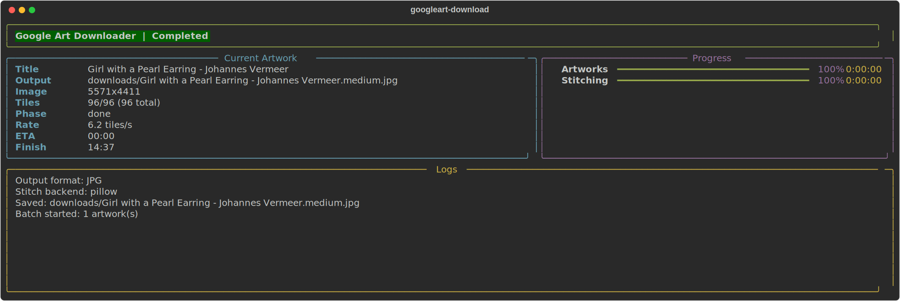
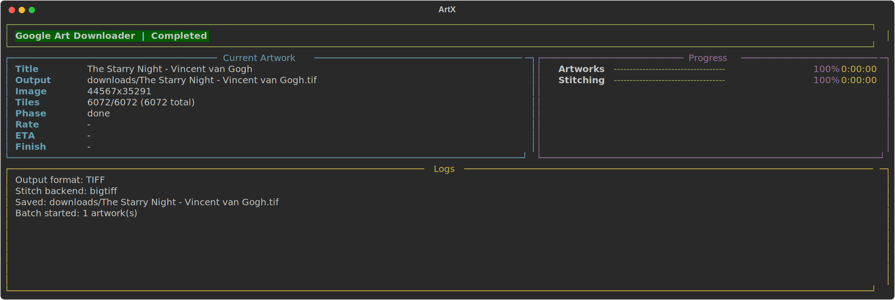

# Google art download

[](#install)
[](pyproject.toml)
[](LICENSE)

[中文说明](docs/README.zh-CN.md)

Download high-resolution images from Google Arts & Culture artwork pages.

`googleart-download` resolves the artwork page, downloads the tiled image pyramid, and stitches the final image locally. It is built for reliability first: batch runs, retry handling, tile-cache reuse, interrupted-run recovery, and safe handling for very large artworks.

## Highlights

- Downloads a single artwork, a URL list, or a batch file.
- Supports multiple input forms for the same artwork:
  - full artwork URL
  - artwork URL with viewer query params
  - official `g.co/arts/...` short links
  - bare asset id such as `3QFHLJgXCmQm2Q`
- Reuses cached tiles after interruption instead of starting over.
- Supports batch resume and rerun of only failed tasks.
- Lets you inspect available download sizes before downloading.
- Supports `--tile-only` when you want raw downloaded tiles without stitching.
- Supports `--stitch-from-tiles` when you want to assemble a final image later from an existing `.tiles` directory.
- Automatically switches very large artworks to TIFF/BigTIFF output for safer streaming stitch.
- Supports metadata-only export and optional sidecar / EXIF metadata output.

## Why This Project

Google Arts & Culture artwork pages use image tiles. A simple “save image” workflow does not recover the full artwork.

This project focuses on the practical problems that appear once you try to download real artwork pages at scale:

- broken or retried tile requests
- interrupted downloads
- very large artworks that should not be stitched fully in memory
- batch runs that need to be resumed instead of restarted

## Install

```bash
uv sync
```

Run the CLI:

```bash
uv run googleart-download --help
```

If you want optional large-image extras:

```bash
uv sync --extra large-images
```

## Quick Start

Download one artwork:

```bash
uv run googleart-download "https://artsandculture.google.com/asset/girl-with-a-pearl-earring/3QFHLJgXCmQm2Q" -o downloads
```

Use a short asset id instead of a long URL:

```bash
uv run googleart-download "3QFHLJgXCmQm2Q" --size preview
```

Inspect sizes before downloading:

```bash
uv run googleart-download "3QFHLJgXCmQm2Q" --list-sizes
```

Export artwork metadata only:

```bash
uv run googleart-download "3QFHLJgXCmQm2Q" --metadata-only
```

<a href="docs/assets/tui-preview.svg">
  
</a>

_Screenshot generated from the current TUI output._

## Common Tasks

Choose a user-friendly download size:

```bash
uv run googleart-download "3QFHLJgXCmQm2Q" --size preview
uv run googleart-download "3QFHLJgXCmQm2Q" --size medium
uv run googleart-download "3QFHLJgXCmQm2Q" --size large
uv run googleart-download "3QFHLJgXCmQm2Q" --size max
```

Resume an interrupted batch:

```bash
uv run googleart-download --url-file urls.txt --resume-batch
```

Rerun only failed tasks from the previous batch:

```bash
uv run googleart-download --rerun-failed
```

Use `--resume-batch` when a batch stopped partway through and you want to continue it. Use `--rerun-failed` when you want a fresh batch containing only the tasks that failed last time.

Write metadata sidecars or EXIF:

```bash
uv run googleart-download "3QFHLJgXCmQm2Q" --write-sidecar
uv run googleart-download "3QFHLJgXCmQm2Q" --write-metadata
```

Download tiles only without stitching:

```bash
uv run googleart-download "3QFHLJgXCmQm2Q" --tile-only
```

Create the final image later from an existing tile directory:

```bash
uv run googleart-download --stitch-from-tiles "downloads/The Great Wave.tiles"
```

Recommended tile workflow:

```bash
uv run googleart-download "3QFHLJgXCmQm2Q" --tile-only
uv run googleart-download --stitch-from-tiles "downloads/The Great Wave.tiles"
```

Adjust JPEG quality for JPEG outputs:

```bash
uv run googleart-download "3QFHLJgXCmQm2Q" --jpeg-quality 85
uv run googleart-download "3QFHLJgXCmQm2Q" --jpeg-preset balanced
```

Use an explicit proxy when Google Arts is blocked or unstable from your network:

```bash
uv run googleart-download "3QFHLJgXCmQm2Q" --proxy http://127.0.0.1:7890
```

If you prefer environment variables, standard proxy variables such as `HTTPS_PROXY` and `ALL_PROXY` also work. An explicit `--proxy` takes precedence over environment proxy settings.

## Output Format Behavior

Normal-sized artworks default to JPEG output.

Very large artworks may switch to TIFF/BigTIFF output automatically. This is intentional and still counts as the normal success path. The project uses a safer streaming stitch path for large outputs instead of trying to build the full image in memory and then write a JPEG.

Large-image JPEG conversion is not part of the default path. If you need a JPEG from a very large TIFF result, convert it yourself as a separate post-process step.

`--tile-only` skips stitching entirely and writes a visible tile directory such as `The Great Wave.tiles/`. That directory contains:

- `tiles/*.tile` downloaded tile files
- `state.json` describing the tile-only download state

Internally, tile-only downloads also keep a hidden stable cache under `.googleart-cache/` keyed by artwork identity instead of the visible directory name. This separation is intentional:

- the visible `.tiles/` directory remains the user-facing artifact
- the hidden cache avoids accidental tile reuse between different artworks that would otherwise collide by output name
- when tile-only finishes successfully, the visible `.tiles/` directory is materialized from the hidden cache, so tile data is intentionally duplicated in those two locations while the hidden cache is retained

`--output-conflict` applies to the output that the current command would write:

- normal download: the final image file
- `--tile-only`: the visible `.tiles/` directory
- `--stitch-from-tiles`: the final stitched image

When `--tile-only` is used with `--output-conflict`:

- `skip` only reports skipped when the existing `.tiles` directory is already a complete result for the same artwork
- `overwrite` removes the existing tile directory before downloading again
- `rename` writes a new sibling directory such as `The Great Wave.2.tiles`

When `--tile-only` sees an existing `.tiles` directory for a different artwork, it continues the download instead of reporting skipped.

When `--stitch-from-tiles` is used, the CLI reads `state.json` and `tiles/*.tile` from the existing `.tiles` directory, then writes a final image using the selected stitch backend. In the current implementation this path does not restore metadata sidecars or EXIF from the earlier tile-only download.

<a href="docs/assets/large-image-tiff.svg">
  
</a>

_Screenshot generated from the current TUI output._

## More Documentation

- [Usage Guide](docs/usage.md): CLI usage, batch workflows, resume, rerun, conflict handling
- [Large Images](docs/large-images.md): large artwork behavior, TIFF/BigTIFF path, cache reuse, size inspection
- [Metadata Guide](docs/metadata.md): metadata-only export, sidecars, EXIF behavior
- [Testing Guide](docs/testing.md): local checks, test layers, and manual smoke workflow
- [Development Guide](docs/development.md): local workflow, tooling, CI, and generated assets
- [Architecture Notes](docs/architecture.md): internal architecture and implementation notes
- [Project Status](docs/project-status.md): current status and planned work

## Current Scope

- Works on artwork pages, not full collections or story pages.
- Large-image TIFF output is supported; automatic TIFF-to-JPEG conversion is intentionally not in the default flow.
- Some richer metadata export ideas are planned, but the current metadata features remain intentionally conservative.
- Released under the MIT License.
